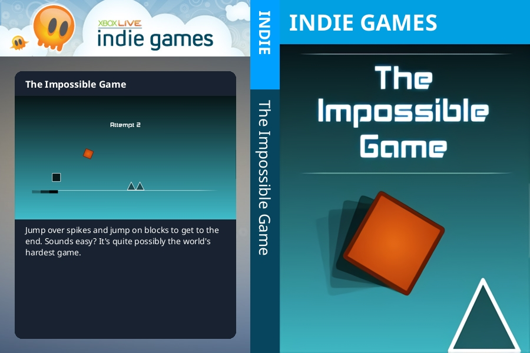

# Xbox360 Full Cover Generator

## Description

Generate a full cover from a set of text and images.

## Requirements

- Python3
- A python package manager. Examples below will use `pip`
- waifu2x - Only required if using the denoise or upscaling functionality
- Graphics Card - Only required if using the denoise or upscaling functionality

## Setup

### Install required python packages

```bash
python -m pip install -r requirements.txt
```

### Install waifu2x (only required if using denoise or upscaling functionality)

1. Download a `.zip` release of [waifu2x-ncnn-vulkan](https://github.com/nihui/waifu2x-ncnn-vulkan/releases) for your operating system.
2. Extract the `.zip` archive into the root of this repository.
3. Rename the folder to `waifu2x`

This should result in the waifu2x executable file existing at `xbox360-full-cover-generator/waifu2x/waifu2x-ncnn-vulkan`

## Usage

```text
usage: Full Cover Generator [-h] [--category {arcade,homebrew,game,indie,kinect,xbox,xbox360}] [--title TEXT]
                            [--title-file FILE] [--description TEXT] [--description-file FILE] [--front-boxart FILE]
                            [--front-boxart-denoise {-1,0,1,2,3}] [--front-boxart-scale {1,2,4,8,16,32}]
                            [--rear-background FILE] [--rear-banner FILE] [--rear-screenshot FILE]
                            outfile

Generate a full cover from a set of text and images.

positional arguments:
  outfile               location to save generated cover

options:
  -h, --help            show this help message and exit
  --category {arcade,homebrew,game,indie,kinect,xbox,xbox360}
                        game category to determine which banner to use. Defaults to 'game'
  --title TEXT          game title
  --title-file FILE     file containing game title
  --description TEXT    game description
  --description-file FILE
                        file containing game description
  --front-boxart FILE   image to use as the boxart on the front cover
  --front-boxart-denoise {-1,0,1,2,3}
                        (Requires waifu2x) denoise boxart used on the front cover. Defaults to '0'
  --front-boxart-scale {1,2,4,8,16,32}
                        (Requires waifu2x) scale boxart used on the front cover. Defaults to '1'
  --rear-background FILE
                        image to use as the background on the rear cover
  --rear-banner FILE    image to use as the banner on the rear cover
  --rear-screenshot FILE
                        image to use as the screenshot on the rear cover
```

After creating the following files contianing the information for the game `The Impossible Game`:

- title.txt - A text file containing the game's title.
- description.txt - A text file containing the game's description.
- background.jpg
- banner.jpg
- boxart.jpg
- screenshot.jpg

The command to generate a cover and the generated cover might look like:

```bash
python main.py \
    --category indie \
    --title-file title.txt \
    --description-file description.txt \
    --front-boxart boxart.jpg \
    --front-boxart-denoise 3 \
    --front-boxart-scale 2 \
    --rear-background background.jpg \
    --rear-banner banner.jpg \
    --rear-screenshot screenshot.jpg
```



## Examples

- [Category Banners](./docs/category_banners.md)
- [Denoise and Upscale](./docs/denoise_and_upscale.md)
- [Rear Cover Variations](./docs/rear_cover_variations.md)
