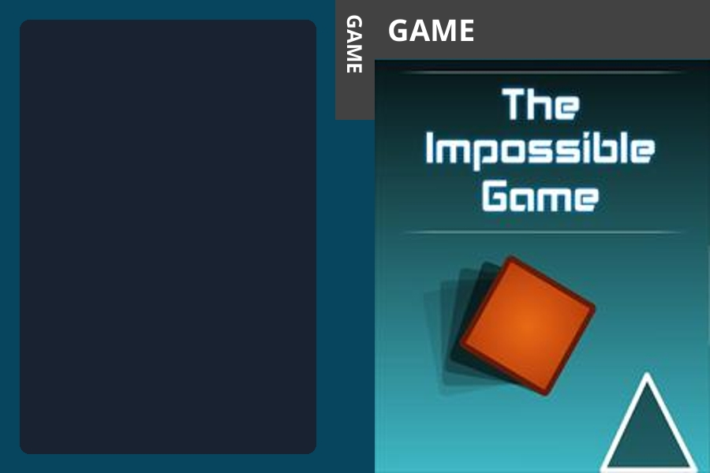
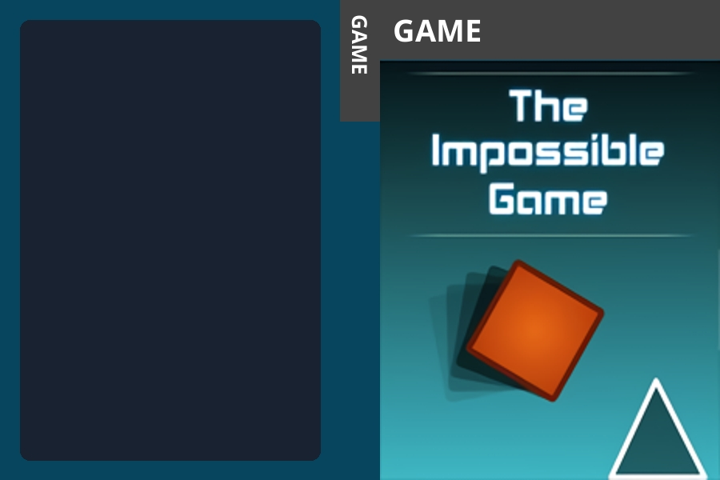
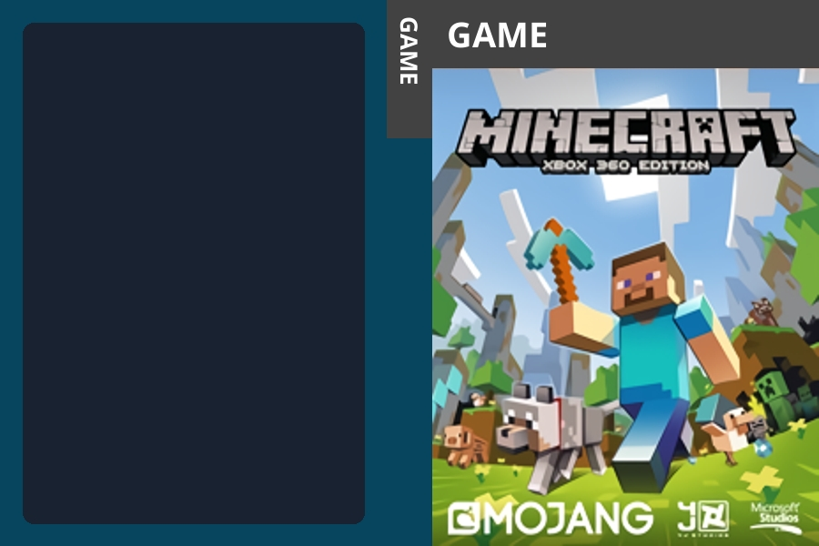

# Denoise and Upscale

## Impossible Game

The Impossible Game boxart is made up of very basic shapes and gradients, allowing for a high denoise level to be very effective.

| Scale    | Denoise  | Result                                                                                   |
| -------- | -------- | ---------------------------------------------------------------------------------------- |
| None (1) | None (0) |  |
| None (1) | 3        |   |
| 2        | None (0) |   |
| 2        | 3        |    |

## Minecraft

The Minecraft boxart contains a lot of sharp angles, making a strong denoise level ruin the artwork.

| Scale    | Denoise  | Result                                                                             |
| -------- | -------- | ---------------------------------------------------------------------------------- |
| None (1) | None (0) |  |
| None (1) | 3        |   |
| 2        | None (0) |   |
| 2        | 3        |    |
